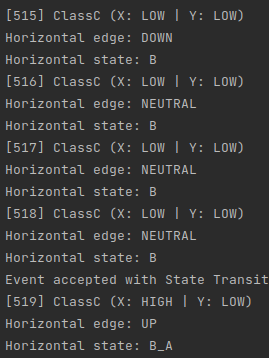
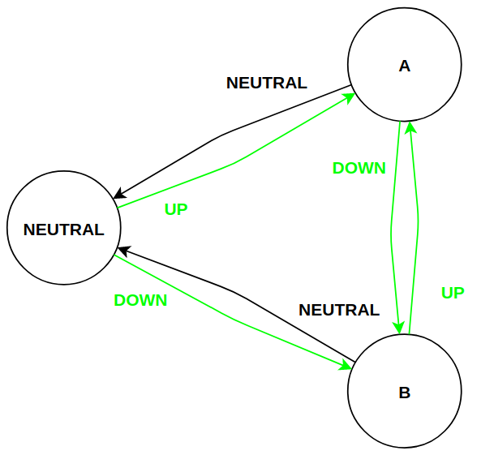
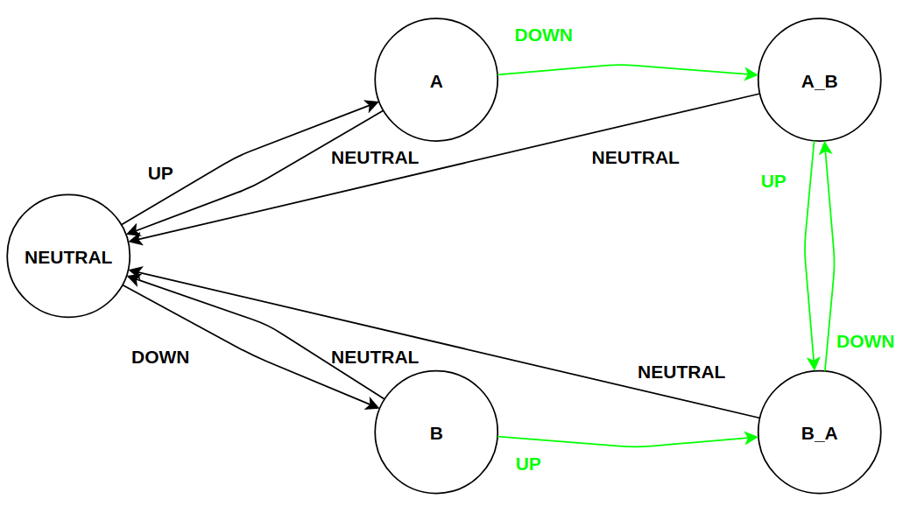
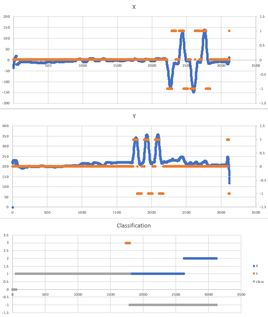
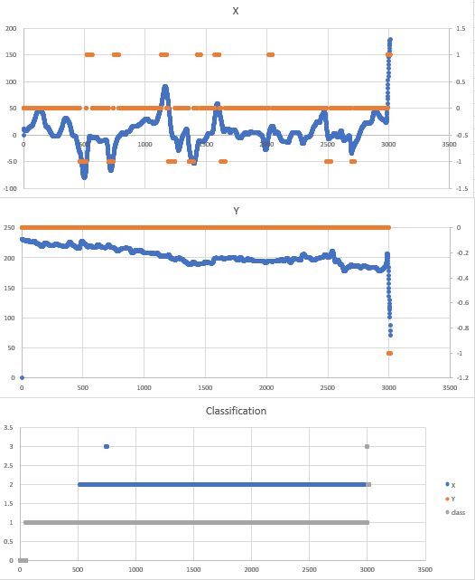
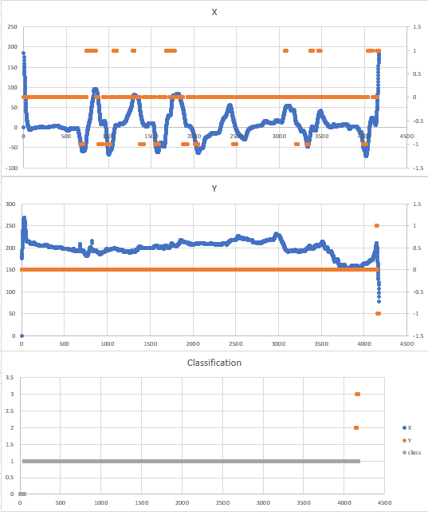
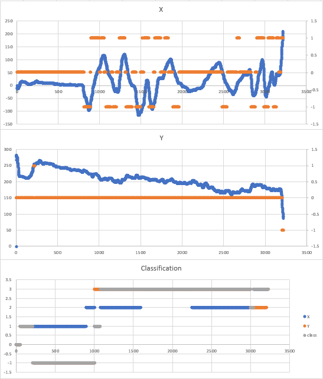
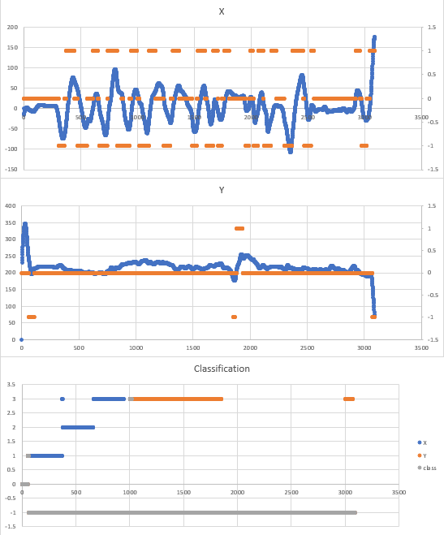

# Hand movement classification with Dempster Shafer using LEAP data

This Java application reads hand movement data obtained with a [Leap Motion Controller](https://www.ultraleap.com/product/leap-motion-controller/) from playing a game with predefined movements and actions. The app identifies particular movements, calculates their frequencies and determines a difficulty level for the player.

The following table matches frequencies and difficulties and shall be realized:

| Movement | Class A | Class B | Class C |
|--------- | ------- | ------- | ------- |
Variation of height | HIGH, MEDIUM | MEDIUM, LOW | LOW |
Left-right-movement with immediate counter-movement | HIGH, MEDIUM | MEDIUM, LOW | LOW |
Multiple thumb spreads (missed shot) | HIGH, MEDIUM | MEDIUM, LOW | LOW |
Spread of all fingers (spasm) | HIGH, MEDIUM | MEDIUM, LOW | LOW |

This project originates from a University project at [Baden-Wuerttemberg Cooperative State University (DHBW)](https://www.dhbw.de/english/home) by [sarcaustech](https://github.com/sarcaustech) and [niels-hb](hhttps://github.com/niels-hb).

## Usage

With Gradle: 
```
./gradlew bootRun -Pargs=--file=<PATH_TO_CSV>,--out=<PATH_TO_CSV>
```
With plain Java (after compiling): 
```
java -jar <PATH_TO_JAR> --file=<PATH_TO_CSV> --out=<PATH_TO_CSV>
```

- `file`: Input CSV file with LEAP data
- `out`: Output CSV file (optional)

The results are printed to the application log and as optional CSV.

Parameters can be customized in [application.yml](./src/main/resources/application.yml).

## Concept

### Time-series data analysis
The first step of the app's calculation is to read particular movements from the data. The data consists of measures per frame. Movements are detected by applying time boxes. This means that there are boxes containing a customizable number of records, on which observations take place (e.g. what is a max. and min. value within the last 50 frames).

The relevant data consists of multiple features with double values. A movement is detected leveraging the following algorithm:
```
IF (max_of_box - min_of_box) >= threshold
    IF first_of_box > last_of_box
        RETURN movement up
    ELSE 
        RETURN movement down
ELSE
    RETURN no movement
```

This leads to two calibration parameters: The number of frames within a box and the threshold. These are be set for each observation individually.

### Finite state machine (FSM)
To extract more complex movements (or movement pattern) from these simple movements *up*, *down* or *no movement*, finite state machines are used. Per target movement, one FSM is implemented for individual logic. This allows wide customization per movement. While defining the states of the FSM, success handlers on transitions are used to count transitions into a target movement. This also prevents from counting one movement multiple times since then, the state machine does not change state.

Additionally, there is an option to buffer *no movement* transitions. It can be useful when the target movement is defined by multiple simple movements (e.g. a movement and an immediate counter-movement). To not reset the observation by a single *no movement* box / frame, one can define how many *no movement*s are buffered before actually firing them at the FSM.

The following image shows that, despite the interim *NEUTRAL* edge (frames 516-518), the state machine keeps its state *B* coming from *DOWN* to where *UP* is measured and proceeds to *B_A* representing a horizontal counter-movement.



### Movement frequencies
Using the counts from the FSM, frequencies can be calculated. Then, these are classified as *LOW*, *MEDIUM* or *HIGH*. For each target movement, the threshold for each category can be set individually.

In addition to the levels explained, a fourth level of frequency is introduced: *RANDOM*. This represents values higher than a *HIGH* upper limit and catches situations where a user behaves rather randomly than according to the game.   

### Dempster Shafer theory (DST)
DST is used to determine a difficulty level from the categorized movement frequencies. See [Wikipedia](https://en.wikipedia.org/wiki/Dempster%E2%80%93Shafer_theory) for more info about DST.

For each calculated movement, an observation for DST is generated. E.g. the variation of height is *MEDIUM*, we can say that, with a certain *mass*, the movement corresponds to either Class A or B. Aggregating these facts over all movements, DST provides a *belief*, *plausibility* and *doubt* for each class. Here, the class with the highest plausibility is chosen as the player's difficulty level. If multiple classes have the same plausibility, the easiest of these is selected, preferring the success for the player over possible frustration.

To properly acknowledge a *RANDOM* frequency, different certainties are used. A certainty represents how certain a fact mentioned above is. Here, facts for *RANDOM* are set with a higher certainty than any other. This leads to a higher penalization of *RANDOM*. \
This app uses a certainty of 0.6 for general facts and 0.9 for *RANDOM*. Whenever a *RANDOM* is detected, the frame is classified as *ClassD* for randomness. These numbers are dependent on how many motions / observations are considered and would have to be adjusted when adding new observations.

With *RANDOM*, the adjusted DST table is:

| Movement | Class A | Class B | Class C | Class D |
|--------- | ------- | ------- | ------- | ------- |
Variation of height | HIGH, MEDIUM | MEDIUM, LOW | LOW | RANDOM |
Left-right-movement with immediate counter-movement | HIGH, MEDIUM | MEDIUM, LOW | LOW | RANDOM |
Multiple thumb spreads (missed shot) | HIGH, MEDIUM | MEDIUM, LOW | LOW | RANDOM |
Spread of all fingers (spasm) | HIGH, MEDIUM | MEDIUM, LOW | LOW | RANDOM |

## Implementation
The implementation follows the concept above.

### Approach for the variation of height
This is the easies target movement. The simple movements *UP* and *DOWN* are directly mappable to the target movement. The FSM consists of three states representing both of these and *no variation of height*.

The implemented FSM is shown below. The green transitions represent a detected motion and increase the counter. The leveraged FSM library allows skipping transitions keeping the machine's state. Therefore, these are not displayed here either.



### Approach for the horizontal counter-movement
This adds counter-movement to the same logic as for the variation of height. The FSM consists of five states not only representing *no movement*, *left* and *right*, but also *left-right*, if a move to left is directly follows by a move to the right, and *right-left*. With these, the two paths for the target movement can be realized:

- No movement -> Left -> Left-right
- No movement-> Right -> Right-left

The implemented FSM is shown below.




Each last transition marks a success and is counted by the state machine.

### Approach for multiple thumb spreads
*(not implemented)* \
This is similar to the horizontal counter-movement, because a short spread of the thumbs matches shooting in-game. Here, there is no counter-movement, but the same movement pattern at least twice. In data, this means a FSE for the path *No movement -> open -> close -> open -> close* since the data gives the angle between thumb and palm. 

It is important to note, that this cannot be directly linked to the single value of the thumb's angle. If there's a hand spread, the thumb spreads, too. This target movement points tn only spreading the thumb, so this has to be observed and thumb spreads due to hand spreads have to be mitigated.

### Approach for spreading all fingers / the hand
*(not implemented)* \
Respecting the explained issue of distinguishing spreading a thumb and all fingers, this equals the variation of height logic. Spreading the hand represents a spasm. Therefore, a quickly increasing angle (just like the height) can be used as criteria.

### Time domain and FPS
For a more intuitive way calibrate, frame numbers shall be transformed to the time domain. This is done using a *frames per second* constant. This is set in [application.yml](./src/main/resources/application.yml).

From the given example data and the description that each measurement is as least 1 minute long, the FPS rate is assumed to be 50.

### First records
PLaying the game or starting a measurement, users are assumed to first click the *Start* button and then positioning themselves and their hands above the sensor. Then, the very first frames represent non-representative data. Therefore, there's an option to skip a duration at the beginning. This is set to 1 second.

### Calibration
The calibration for the time boxes were done with a given example dataset holding predefined movements.

The calibration of what is a *LOW* /... frequency would require more information about the game, its steering and players' assessments. The thresholds for the categorization are chosen based on two more data samples with no info about the player of the movements he/she is required to do. This is an immense lack of information since the app tries to detect unnecessary movements, but from data only, one cannot say which movement was necessary und which not. This leads to the corresponding parameter being easily customizable for someone with more intel.

## Results and assessment
The application is executed for five data samples. The results are shown in the images below. To display distinct values in the same plot, they are mapped to numbers as follows:

- Edges: *UP* = 1, *DOWN* = -1, *NEUTRAL* = 0
- Frequencies: *LOW* = 1, *MEDIUM* = 2, *HIGH* = 3, *RANDOM* = -1(, undefined = 0, when skipping frames)
- Classes: *ClassA* = 3, *ClassB* = 2, *ClassC* = 1, *ClassD* = -1(, undefined = 0, when skipping frames)

The XLSX sheet containing the graphics can be found [here](./docs/samples.xlsx).

#### Sample 0
This is demo data. Here, predefined movements are performed. This is no sample related to the game.



#### Sample 1


#### Sample 2


#### Sample 3


#### Sample 4


The first two plot of each sample show the measured data for the palm position in X and Y dimension in blue. The orange points represent the detected edge *UP*, *DOWN* and *NEUTRAL*. Here, we see an overall good match for the detected edges. Some particular frames are questionable in terms of if they should be detected or not. This is especially the case for the Y dimension. Sample 1 and 3 both show a decreasing height of the palm in the long run. Here, data should be compared with the users' assessment to re-calibrate. Sample 4 shows that a change of the palm's height is detected correctly (see frame 1,800 - 1,900).

Most samples show significant different behavior during the first frames. This supports the application's option to skip frame in the beginning. This also happens at the end of a measurement. From the perspective of a live classification, the end of a game cannot be determined without game context. Therefore, the misleading classification at the end cannot be skipped. This has to be seen in the context of a user quitting the current game. Then, the live classification is not important anyways, so this is not expected to be important either.

The classification diagram of sample 3 shows how the classification stabilizes over time. This is expected since during frequency calculation over a short period of time, a single event effects the frequency more than over a long period of time. Therefore, we see the jump of the frequency level of the vertical movement (Y) from *LOW* to *RANDOM* which means more than a *HIGH* frequency. Then, the level slowly decreases as there is more time passed but no event detected. At the end, another event is detected which lifts the level from *MEDIUM* to *HIGH*, being less volatile. This leads to the conclusion, that longer measurements are more resilient and should be preferred.

Overall, the application and implemented model show their capability to classify different LEAP motion data samples into different classes, based on DST. All game samples (1 - 4) have been assigned to different classes. Ultimately, this only shows the technical feasibility. Without more intel about the game, especially which sequences of the game correspond to the samples, and the users' assessment, we cannot conclude whether this matches the target classification and behavior of the game.

## Acknowledgements
- Benjamin Führnohr, author of the class for plain DST (see [de.dhbw.tinf18e.LeapMotionClassifier.ai.dempster](./src/main/java/de/dhbw/tinf18e/LeapMotionClassifier/ai/dempster))
- [himanshuvirmani](https://github.com/himanshuvirmani/), author of the used FSM library [java-state-machine](https://github.com/himanshuvirmani/java-state-machine)

